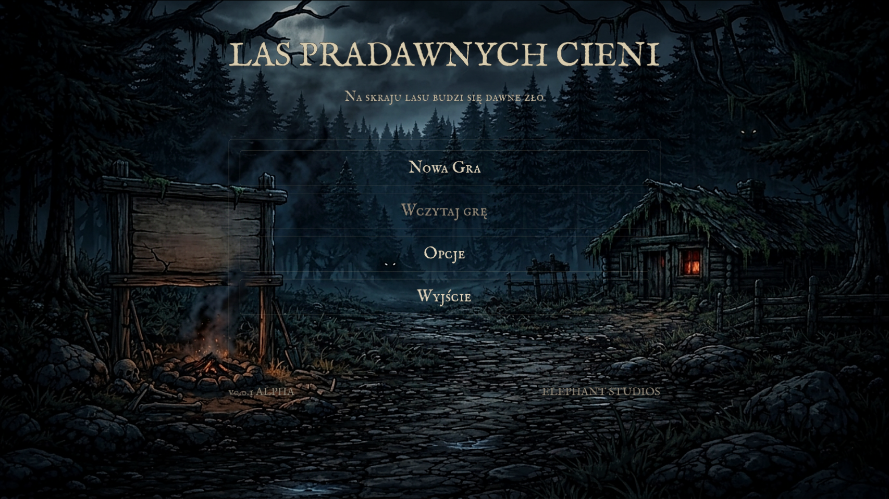
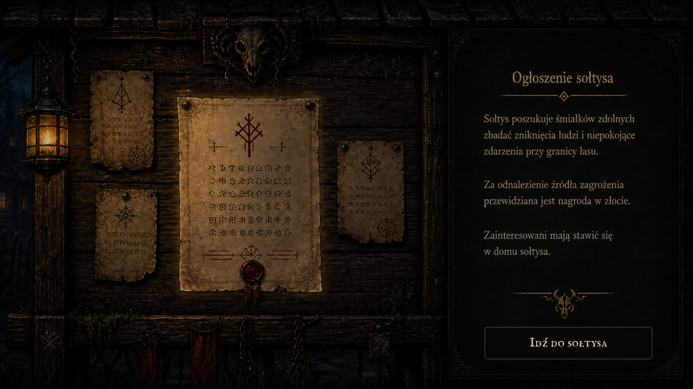
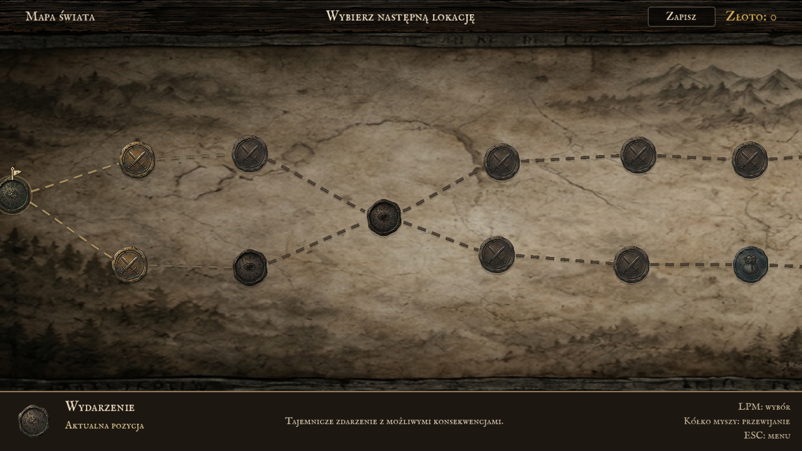
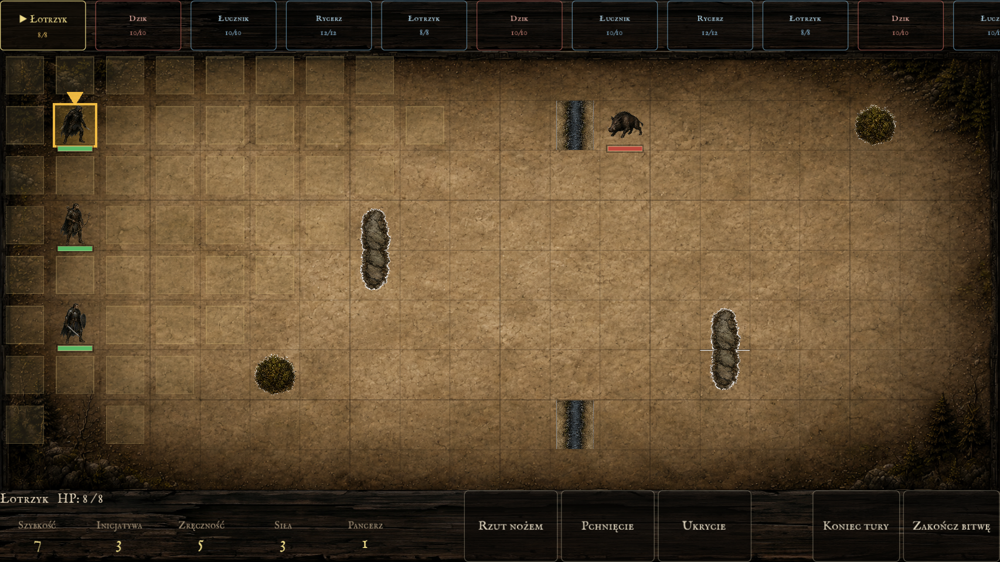
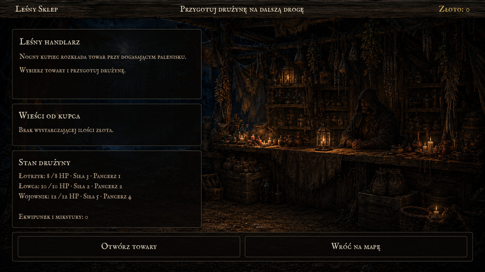
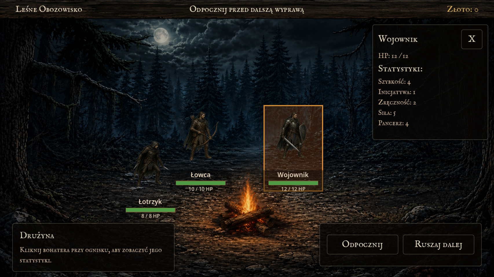
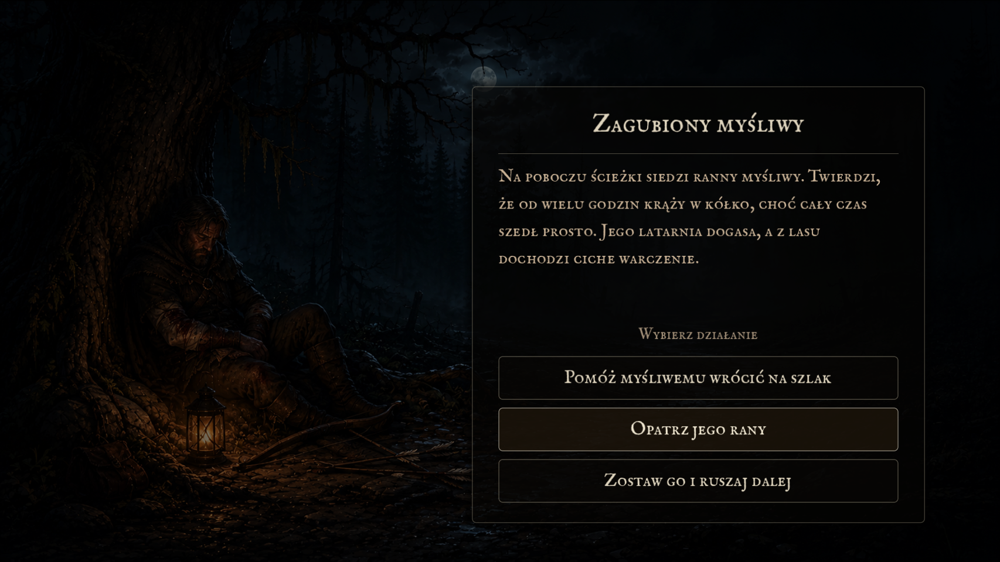
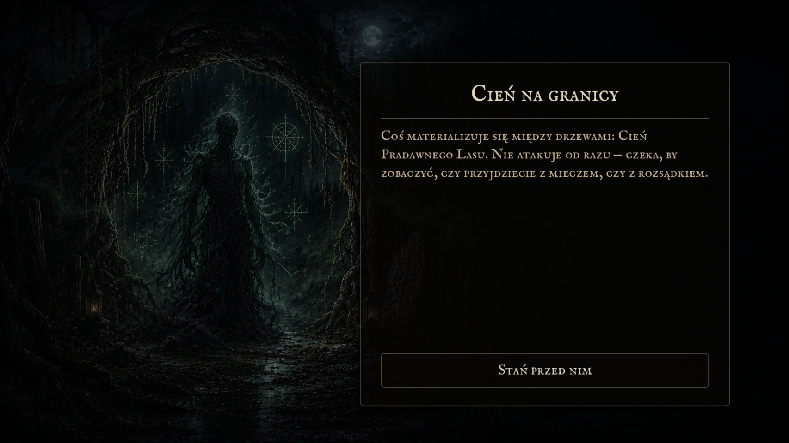

# Las Pradawnych Cieni

**Las Pradawnych Cieni** to taktyczna gra turowa 2D tworzona w silniku Godot w ramach przedmiotu **Technologie gier komputerowych**. Projekt łączy eksplorację mapy świata w formie grafu lokacji, kameralne starcia na planszach taktycznych, zarządzanie drużyną oraz krótkie wydarzenia fabularne osadzone w świecie mrocznego fantasy inspirowanego folklorem.

Projekt został przygotowany jako semestralny prototyp gry jednoosobowej. Jego zakres skupia się na pełnej, czytelnej pętli rozgrywki: rozpoczęciu wyprawy, wyborze ścieżki na mapie, walce, odpoczynku, zakupach, odkrywaniu fabularnych wskazówek i dotarciu do finałowego rozstrzygnięcia.

## Spis treści

- [O projekcie](#o-projekcie)
- [Założenia z dokumentu koncepcyjnego](#pierwotne-założenia-koncepcyjne)
- [Fabuła](#fabuła)
- [Główna pętla rozgrywki](#główna-pętla-rozgrywki)
- [Mapa świata](#mapa-świata)
- [System walki](#system-walki)
- [Drużyna i statystyki](#drużyna-i-statystyki)
- [Ekonomia, sklep i odpoczynek](#ekonomia-sklep-i-odpoczynek)
- [Wydarzenia fabularne i finał](#wydarzenia-fabularne-i-finał)
- [Oprawa audiowizualna](#oprawa-audiowizualna)
- [Screeny](#screeny)
- [Struktura projektu](#struktura-projektu)
- [Uruchomienie projektu](#uruchomienie-projektu)
- [Sterowanie](#sterowanie)
- [Zakres MVP](#zakres-mvp)
- [Technologie](#technologie)
- [Autorzy](#autorzy)
- [Wykorzystanie AI](#wykorzystanie-ai)
- [Release](#release)

## O projekcie

Gra została zaprojektowana jako niewielka, spójna taktyczna gra RPG z widokiem z góry. Gracz prowadzi trzyosobową drużynę przez niebezpieczny las, wybiera kolejne lokacje na mapie i podejmuje decyzje wpływające na stan zespołu, zdobyte zasoby oraz kontekst finału.

Najważniejsze cechy:

- gatunek: turowa gra taktyczna z elementami RPG,
- perspektywa: top-down 2D,
- tryb: single player,
- silnik: Godot,
- struktura: mapa świata jako graf połączonych lokacji oraz osobne sceny walki,
- klimat: mroczne fantasy, folklor, pradawny las, moralnie niejednoznaczny konflikt,
- skala: pełny prototyp semestralny przygotowany dla ograniczonego zakresu produkcyjnego.

## Pierwotne założenia koncepcyjne

Pierwotny plan projektowy zakładał stworzenie gry, która nie próbuje imitować dużej produkcji RPG, lecz koncentruje się na kilku mocnych filarach:

- przejrzystej eksploracji po mapie-grafie,
- taktycznych walkach turowych na małych planszach,
- budowaniu drużyny o różnych rolach,
- prostym zarządzaniu zdrowiem, złotem i przedmiotami,
- wydarzeniach tekstowych wzmacniających fabułę,
- końcowej konfrontacji zależnej od odkrytych informacji i wyborów.

Inspiracjami projektowymi były między innymi:

- **Heroes of Might and Magic 3** jako punkt odniesienia dla czytelnej taktycznej planszy i fantastycznej wyprawy,
- **Warhammer 40,000: Mechanicus** jako inspiracja dla walki taktycznej opartej na pozycjonowaniu,
- **Slay the Spire** jako inspiracja dla mapy z rozgałęzionymi ścieżkami, lokacjami i kontrolowaną progresją.

Wersja implementowana w repozytorium rozwija te założenia w kierunku pełnej pętli gry: od prologu, przez generowaną mapę, aż po finał i epilog.

## Fabuła

Akcja gry rozgrywa się wokół osady położonej na skraju zakazanego, starożytnego lasu. Mieszkańcy od pokoleń żyli w cieniu lokalnych wierzeń i opowieści o opiekuńczym bóstwie, lecz narastające ataki, grabieże i niepokojące zachowanie zwierząt sugerują, że w lesie obudziła się siła starsza niż pamięć wioski.

Sołtys wystawia ogłoszenie i obiecuje nagrodę śmiałkom, którzy zbadają źródło zagrożenia. Drużyna rusza na wyprawę, ale z czasem odkrywa, że problem nie sprowadza się do prostego podziału na dobro i zło. Kolejne checkpointy i wydarzenia odsłaniają ślady dawnych przysiąg, przemilczeń oraz konfliktu między ludźmi a lasem.

Finał gry może prowadzić do walki z głównym przeciwnikiem albo do innego rozstrzygnięcia, zależnie od wiedzy zdobytej w trakcie podróży.

## Główna pętla rozgrywki

1. Gracz rozpoczyna wyprawę z drużyną trzech bohaterów.
2. Na mapie świata wybiera jedną z dostępnych lokacji.
3. Lokacja uruchamia odpowiednią scenę: walkę, odpoczynek, sklep, wydarzenie lub checkpoint fabularny.
4. Po ukończeniu lokacji gra odblokowuje kolejne wierzchołki grafu.
5. Drużyna zdobywa złoto, leczy rany, kupuje wyposażenie i odkrywa informacje.
6. Po przejściu kolejnych warstw mapy gracz dociera do finału.
7. Finał podsumowuje wcześniejsze decyzje i kończy run epilogiem.

## Mapa świata

Mapa świata jest generowanym grafem lokacji. Każdy wierzchołek ma typ, pozycję, akt i listę połączeń prowadzących dalej. Gracz nie porusza się swobodnie po otwartym świecie, tylko wybiera kolejne dostępne punkty wyprawy.

Zaimplementowane typy lokacji:

- **walka** - starcie z grupą przeciwników i nagroda po zwycięstwie,
- **odpoczynek** - regeneracja drużyny i przygotowanie do dalszej drogi,
- **sklep** - zakup leczenia, ekwipunku i przydatnych przedmiotów,
- **wydarzenie** - tekstowa scena z wyborem decyzji,
- **checkpoint fabularny** - ważny punkt historii zapisujący odkryte informacje,
- **finał** - ostatnia lokacja prowadząca do rozstrzygnięcia.

Generator mapy kontroluje długość runa, liczbę aktów, rozmieszczenie wydarzeń obowiązkowych, sklep i odpoczynek przed końcem oraz połączenia między warstwami. Dzięki temu mapa zachowuje częściową nieliniowość, ale nadal prowadzi gracza w stronę finału.

## System walki

Walki odbywają się na osobnych planszach taktycznych podzielonych na pola. Kolejność tur wynika z inicjatywy postaci. Bohater w swojej turze może się przemieścić oraz wykonać akcję, a przeciwnicy korzystają z prostego zachowania AI.

Najważniejsze elementy walki:

- siatka taktyczna 20 x 9 pól,
- przeszkody terenowe wpływające na ruch,
- kolejka inicjatywy widoczna w górnym pasku,
- ruch ograniczony statystyką szybkości,
- akcje o różnym zasięgu i działaniu,
- szansa trafienia zależna od mechaniki ataku i obrony,
- panel statystyk aktywnej postaci,
- log walki i podsumowanie zwycięstwa,
- obsługa porażki po utracie całej drużyny.

Walka została zaprojektowana tak, aby była krótka i czytelna. Zamiast dużych bitew projekt stawia na małe starcia, w których znaczenie ma pozycja, zasięg i wybór celu.

## Drużyna i statystyki

Podstawowa drużyna składa się z trzech klas:

- **Rycerz** - wytrzymała postać pierwszej linii, dobra do walki wręcz i osłaniania zespołu.
- **Łotrzyk** - szybka postać ofensywna, korzystająca z mobilności i precyzyjnych ataków.
- **Łucznik** - jednostka dystansowa, która może razić przeciwników z większej odległości.

Postacie korzystają z prostych statystyk:

- punkty życia,
- szybkość,
- inicjatywa,
- zręczność,
- siła,
- pancerz.

Projekt celowo używa niewielkich wartości liczbowych, żeby balans był czytelny, a skutki decyzji łatwe do zauważenia w trakcie jednej wyprawy.

## Ekonomia, sklep i odpoczynek

Po zwycięskich walkach drużyna otrzymuje złoto. Zasób ten można wykorzystać w sklepie na leczenie, przedmioty użytkowe i wyposażenie wzmacniające wybranych bohaterów. Odpoczynek pozwala odzyskać zdrowie i ogranicza ryzyko wejścia w kolejną walkę osłabioną drużyną.

Ten system tworzy prosty model zarządzania ryzykiem: krótsza droga może oznaczać mniej nagród, dłuższa wyprawa daje więcej zasobów, ale zwiększa szansę utraty bohaterów przed finałem.

## Wydarzenia fabularne i finał

Wydarzenia tekstowe oraz checkpointy rozwijają opowieść o lesie, osadzie i dawnych zobowiązaniach. Część scen zapisuje znaczniki wiedzy, które są później wykorzystywane przy finale.

Finał nie jest wyłącznie ostatnią walką. Gra sprawdza, co drużyna odkryła po drodze, i pozwala doprowadzić historię do rozstrzygnięcia zgodnego z wcześniejszymi tropami. Jeżeli konflikt przechodzi w walkę, używana jest osobna plansza finałowa oraz przeciwnik powiązany z głównym zagrożeniem.

## Oprawa audiowizualna

Kierunek artystyczny opisany w dokumencie koncepcyjnym to pixel art oraz średniowieczne fantasy. W projekcie znajdują się przygotowane assety dla:

- tła menu,
- prologu,
- mapy świata,
- wierzchołków mapy,
- plansz walki,
- bohaterów,
- przeciwników,
- sklepu,
- odpoczynku,
- checkpointów,
- finału i epilogu,
- muzyki oraz efektów interfejsu.

Oprawa stawia na baśniowy, niepokojący klimat: ciemny las, drewniane i kamienne elementy UI, przygaszoną kolorystykę oraz ilustracyjne tła scen fabularnych.

## Screeny

Poniższe miejsca są przygotowane na zrzuty ekranu z gry. Pliki można umieścić w katalogu `docs/screenshots`.

### Menu główne



### Prolog



### Mapa świata



### Walka taktyczna



### Sklep



### Odpoczynek



### Wydarzenie fabularne



### Finał



## Struktura projektu

Najważniejsze katalogi i pliki:

```text
.
├── README.md
└── las-pradawnych-cieni/
    ├── project.godot
    ├── export_presets.cfg
    ├── assets/
    │   └── ui/
    ├── data/
    │   └── config/
    ├── scenes/
    │   ├── battle/
    │   ├── checkpoints/
    │   ├── finale/
    │   ├── map/
    │   ├── prologue/
    │   ├── quests/
    │   ├── rest/
    │   ├── shop/
    │   └── ui/
    └── scripts/
        ├── battle/
        ├── checkpoints/
        ├── config/
        ├── finale/
        ├── items/
        ├── map/
        ├── menu/
        ├── prologue/
        ├── quests/
        ├── rest/
        ├── save/
        ├── settings/
        ├── shop/
        ├── team/
        └── ui/
```

Kluczowe moduły:

- `scripts/map/MapState.gd` - globalny stan mapy, odblokowania lokacji, checkpointy, znaczniki fabularne i finał.
- `scripts/map/MapGenerator.gd` - generowanie mapy świata jako grafu.
- `scripts/map/Map.gd` - obsługa sceny mapy, wyboru wierzchołków i przejść między lokacjami.
- `scripts/battle/BattleMap.gd` - główna logika walki turowej.
- `scripts/battle/FinaleBattleMap.gd` - specjalizacja walki finałowej.
- `scripts/team/GameState.gd` i `scripts/team/Team.gd` - stan drużyny, złoto, bohaterowie, ekwipunek i polegli.
- `scripts/save/SaveGame.gd` - zapis i odczyt stanu gry.

## Uruchomienie projektu

Wymagania:

- Godot 4.6 lub zgodna wersja z obsługą projektu,
- system Windows, Linux albo macOS do pracy w edytorze,
- dla gotowego eksportu Windows: plik `.exe`.

Uruchomienie w edytorze:

1. Otwórz Godot.
2. Wybierz opcję importu projektu.
3. Wskaż plik `las-pradawnych-cieni/project.godot`.
4. Uruchom główną scenę projektu.

Uruchomienie eksportu Windows:

1. Uruchom `LasPradawnych Cieni.exe`.

## Sterowanie

- Lewy przycisk myszy - wybór lokacji, przycisków, pól ruchu i celów ataku.
- Rolka myszy - przesuwanie widoku mapy świata w poziomie.
- Escape - menu pauzy lub zamknięcie aktywnego panelu.
- Przyciski interfejsu - kończenie tury, kończenie bitwy, zapis, sklep, odpoczynek i wybory fabularne.

## Zakres MVP

Zgodnie z pierwotną koncepcją MVP miało obejmować:

- oprawę 2D,
- trzy klasy grywalnych postaci,
- prostą mapę świata opartą na grafie,
- kilka starć bojowych,
- sklep,
- odpoczynek,
- głównego bossa,
- finałowy cel wyprawy.

Obecny projekt realizuje te założenia i rozszerza je o generowanie mapy, zapisy gry, checkpointy fabularne, wydarzenia poboczne, finał z decyzjami oraz epilog.

## Technologie

- **Godot 4.6** - silnik gry i edytor scen.
- **GDScript** - implementacja mechanik, UI i stanu gry.
- **AStarGrid2D** - obsługa ruchu po siatce walki.
- **Resource / `.tres`** - konfiguracja mapy, questów, checkpointów i profilu runa.
- **Eksport Windows Desktop** - skonfigurowany w `export_presets.cfg`.

## Autorzy

Projekt realizowany w ramach przedmiotu **Technologie gier komputerowych**.

Autorzy:

- Kacper Bieniasz
- Maciej Nowakowski

## Wykorzystanie AI

Grafiki zostały wygenerowane przy pomocy dużych modeli językowych ChatGPT i Gemini.

## Release

Repozytorium zawiera konfigurację eksportu oraz release dla platformy **Windows Desktop**.
